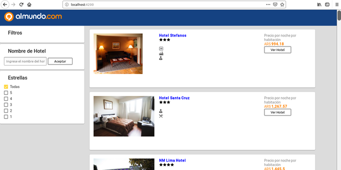

# Almundo test
### Juan David Arias


## Información General
El proyecto está compuesto por una etapa backend y otra frontend. La etapa de backend fue hecha con nodejs e incluye una BD NoSQL en mongodb que es conectada através del servidor.
La etapa de frontend fue construida en Angular.

El repositorio contiene dos carpetas

almundo_backend
almundo_frontend

En cada una de ellas se encuentra el código de la prueba.

## Implementación

Para ejecutar el proyecto es necesario:

1. Clonar el repositorio:  git clone https://github.com/jdaf2008/almundo.git
2. Entrar a cada carpeta : 

## Backend
 El backend fue construido con NodeJs, Express y además se hace la conexión con un BD NoSQL en MondoDB qué contiene la información de todos los hoteles.
 
1. Configurar Mongodb a través de un contenedor DOCKER.

A. Instalar docker en linux Ubuntu:

```sh
$ sudo apt-get install docker.io
```
B. Construir un contenedor basado en la imagen pública de mongodb: 

```sh
$ mkdir ~/data
$ sudo docker run --name mongoALdb -d -p 27017:27017 -v ~/data:/data/db mongo
```

C. Agregar Base de datos y colección, Para eso instalar un cliente de mongo-client y luego entrar a la base de datos y agregar la colection

```sh
$ sudo apt-get install mongodb-clients
$ mongo localhost/almundo_backend
> db.createCollection('hotels')
> db.cities.insertMany([}])
$ c^

```

#### La última línea de insertMany dentro debe ir el array JSON que contiene todos los objetos hotel

2.  Backend. Instalar nodejs y npm 

A.  Ir a la capeta de Backend e instalar paquetes.
```sh
$ cd ./almundo_backend
$ npm install
```
B. Ejecutar Backend
```sh
$ npm start
```

> Puede Presentarse un error de conexión con la BD
> para esto verificar que el contenedor de la BD
> está corriendo en el puerto 27017 y el nombre de 
> la base de datos es almundo

3. Documentación de API REST, con todo el CRUD implementado, pero haciendo uso de dos método, ambos con GET

https://documenter.getpostman.com/view/1026667/S1EJZ279

Respuesta

```sh
    "items": [
        {
            "amenities": [
                "newspaper",
                "business-center",
                "nightclub",
                "children-club",
                "deep-soaking-bathtub"
            ],
            "_id": "5caa06af97aaeb28aa06c922",
            "id": "498515657",
            "name": "test",
            "stars": 3,
            "price": 757.58,
            "image": "5987363_77_b.jpg"
        }
    ],
    "message": "Los datos fueron cargados correctamente"
```

## Frontend

1. Instalar npm.
2. ENtrar a la carpeta de frontend e instalar parquetes
```sh
$ cd ./almundo.frontend
$ npm install
```
3. Ejecutar la aplicación
```sh
$ cd ./almundo.frontend
$ npm install
```

El frontend se verá de la siguiente forma


